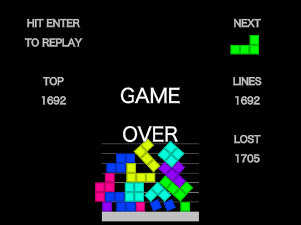

# Physigeh: A Physics-Based Action Puzzle Game

[Physigeh](http://www.physigeh.org/) is a physics-based action puzzle
game.  You can control a falling-down tetromino piece and stack it on
others (as is often the case).  In addition, tetromino pieces follow
the physical laws.

Physigeh is written in JavaScript with the [p5.js](http://p5js.org/)
and [Box2D](http://box2d.org/) libraries.

## Play It

You can play [Physigeh](http://www.physigeh.org/) in your Web browser.
Enjoy!

## Required Libraries and Assets

- [p5.min.js](http://p5js.org/) and
  [p5.dom.min.js](http://p5js.org/reference/#/libraries/p5.dom):
  authored by Lauren McCarthy and her collaborators

- [box2d.min.js](https://github.com/flyover/box2d.js/tree/master/Box2D):
  authored by Erin Catto and
  ported to JavaScript by Isaac Burns

- [Korobeiniki.mp3](https://commons.wikimedia.org/wiki/File%3AKorobeiniki.mid):
  based on a Russian folk song,
  authored by Kyrgyzstan, and
  converted from MID by Hosobe with GarageBand

- [spell1_0.mp3](http://opengameart.org/content/spell-1):
  authored by Bart Kelsey and
  converted from WAV by Hosobe with FFmpeg

- [qubodup-PowerDrain.mp3](http://opengameart.org/content/energy-drain):
  authored by Iwan Gabovitch and
  converted from FLAC by Hosobe with FFmpeg

## Author

[Hiroshi HOSOBE](http://www.hosobe.org/)

## License

GNU General Public License, version 2 (GPL v2)

Copyright (C) 2016 Hiroshi HOSOBE

This program is free software: you can redistribute it and/or modify
it under the terms of the GNU General Public License as published by
the Free Software Foundation; version 2 of the License.

This program is distributed in the hope that it will be useful,
but WITHOUT ANY WARRANTY; without even the implied warranty of
MERCHANTABILITY or FITNESS FOR A PARTICULAR PURPOSE.  See the
GNU General Public License for more details.

You should have received a copy of the GNU General Public License
along with this program.  If not, see <http://www.gnu.org/licenses/>
